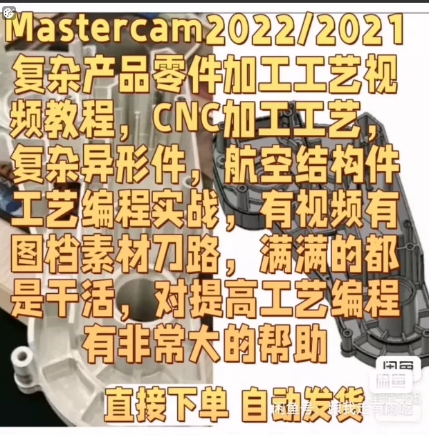
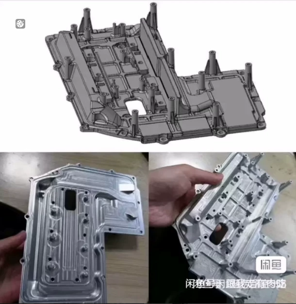
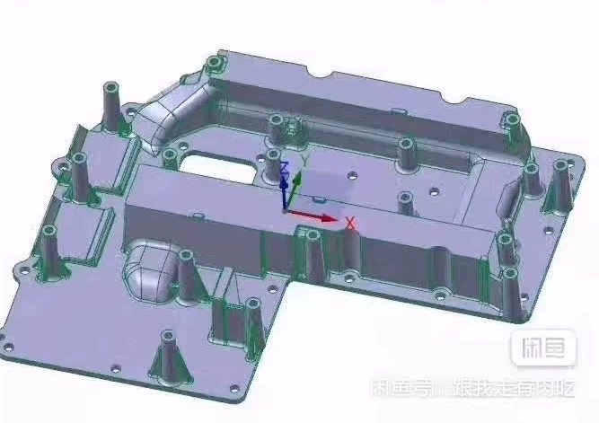
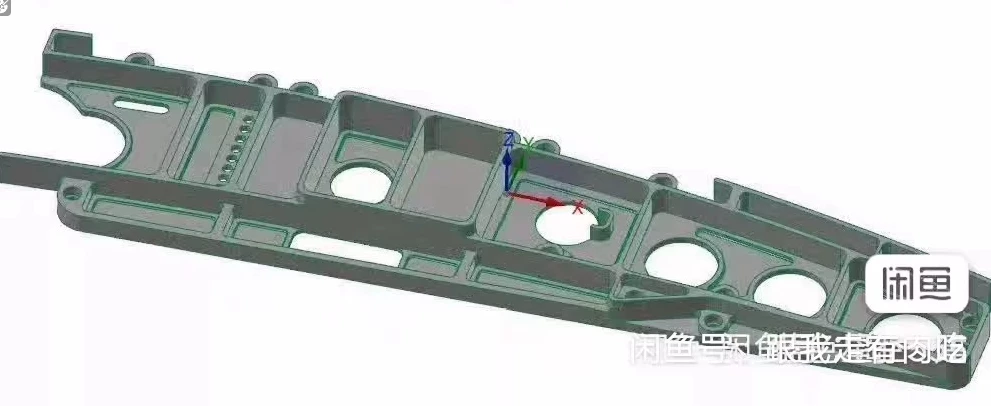
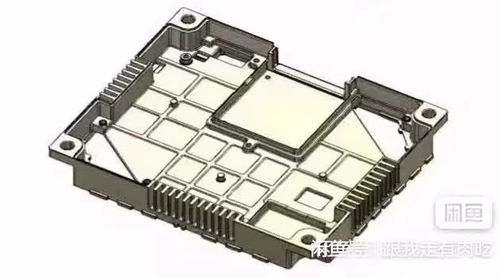

# Mastercam 2022/2021 complex product parts machining process video

## Body

Mastercam 2022/2021 is a powerful tool for creating complex product parts. In this video, we will show you how to use Mastercam 2022/2021 to create a complex product part.

First, open the Mastercam software and select the appropriate file format for your project. Then, create a new part by selecting the appropriate template.

Next, add the necessary features to your part, such as holes, slots, and pockets. Use the tools in the toolbox to create these features and adjust their size and position as needed.

Once you have created all the necessary features, it's time to start machining. Select the appropriate toolpath and set up the machine settings according to your specific requirements.

Finally, test your part to ensure that it meets all of your specifications. If necessary, make any necessary adjustments and repeat the process until you are satisfied with the result.

With Mastercam 2022/2021, you can create complex product parts with ease and precision.

(Full product description was not available from the source page.)

## Images

## Payment

Here is a pay link on Stripe ( https://buy.stripe.com/3cs8yP7sY87d0vu9AB ). Please contact me lonlonago@foxmail.com after funding $89, and I will send you a complete data files , thank you!

